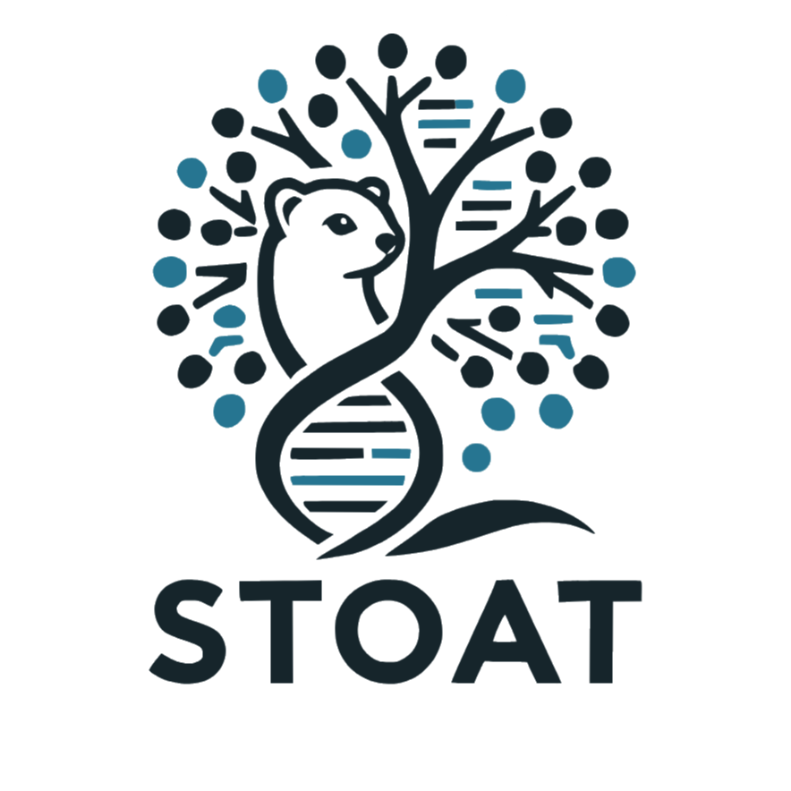
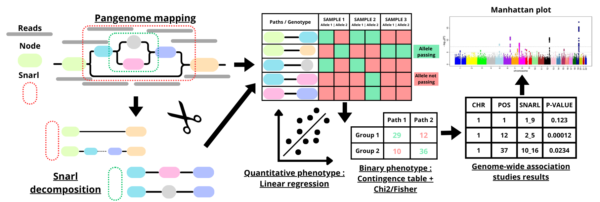

# STOAT (Snarl Tree Orchestrated Association Test)

<p align="center">
    <a href="https://isocpp.org/"></a>
    <a href="https://github.com/vgteam/libbdsg/releases/tag/v0.3"></a>
</p>



## Project Overview




## Dependency

Manual installation : 

STOAT's dependencies (`jansson`, `Protobuf`, `Boost`, `htslib`, `valgrind`) can be installed by running

```
sudo apt-get install build-essential cmake pkg-config libjansson-dev protobuf-compiler libprotoc-dev libprotobuf-dev libboost-all-dev libhts-dev valgrind
```

- [vg](https://github.com/vgteam/vg) (optional)

Note that STOAT uses [`libbdsg`](https://github.com/vgteam/libbdsg) and [`libvgio`](https://github.com/vgteam/libvgio), both of which depend on [`libhandlegraph`](https://github.com/vgteam/libhandlegraph).
STOAT uses its own copies of each of these libraries but if any of them are already installed on your system, then problems may arise if the versions are incompatible.
In general, the latest versions of all of these tools should work.

## Docker

- `Dockerfile` : [Dockerfile](https://github.com/Pa-Tou/stoat/blob/main/Dockerfile)

- `Container` : docker://quay.io/matis_alias-bagarre/stoat

## Build

```bash
git clone --recursive https://github.com/Pa-Tou/stoat.git
cd stoat

mkdir build && cd build
cmake .. && make -j 4
```

This will create a binary file `stoat` in `stoat/bin`. 
It can be run from the main `stoat` directory with:

```bash
./bin/stoat
```

The `bin` directory can be added to your `PATH` variable to allow `stoat` to be run from any directory.
From the `stoat` directory, run:

```bash
echo 'export PATH="${PATH}:'"$(pwd)"'/bin"' >>~/.bashrc
```

Then close your terminal and open it again, or run

```bash
source ~/.bashrc
```

## Running STOAT

STOAT is a specialized tool developed for conducting Genome-Wide Association Studies (GWAS) with a unique focus on snarl structures within pangenome graphs. Unlike traditional GWAS tools that analyze linear genome variants, STOAT uses the [snarl decomposition](https://github.com/vgteam/vg/wiki/Snarls-and-chains) of a graph, which represents nested and overlapping variant patterns within a pangenome. This approach allows for a more nuanced understanding of genetic variations in diverse populations and complex traits.

STOAT supports both binary and quantitative phenotypes:

- For binary phenotypes (e.g., case vs control studies), it utilizes chi-squared tests and Fisher’s exact test to evaluate associations between phenotype groups and snarl variants, providing robust statistical validation even in cases of sparse data.

- For quantitative phenotypes (e.g., traits measured on a continuous scale), the tool employs linear regression models to assess the association between snarl structures and phenotype values, allowing for continuous trait mapping with greater precision.

### Usage
  
`stoat` has two main use cases, finding associations from a [VCF file](https://github.com/Pa-Tou/stoat/wiki/stoat-vcf) and finding associations from [paths in the graph](https://github.com/Pa-Tou/stoat/wiki/stoat-graph).

- Use `stoat vcf` if you want to run a GWAS from a VCF file : 

```bash
# decompose pangenome
stoat vcf -p <pg.full.pg> -d <dist.dist> -o <paths.txt>

# binary trait with already decompose pangenome
stoat vcf -s <paths.txt> -v <vcf_file.vcf.gz> -b <phenotype.txt> --chr <ref.tsv> -o output

# decompose pangenome + binary trait
stoat vcf -p <pg.full.pg> -d <dist.dist> -v <vcf_file.vcf.gz> -b <phenotype.txt> --chr <ref.tsv> -o output

# decompose pangenome + quantative trait
stoat vcf -p <pg.full.pg> -d <dist.dist> -v <vcf_file.vcf.gz> -q <phenotype.txt> --chr <ref.tsv> -o output
```


- Use `stoat graph` if you want to find associations with paths in the graph : 

```bash
stoat graph -g <graph> -d <dist.dist> -S <samples.tsv>
```
### Wiki

For more information about Stoat, see our [wiki documentation](https://github.com/Pa-Tou/stoat/wiki).
