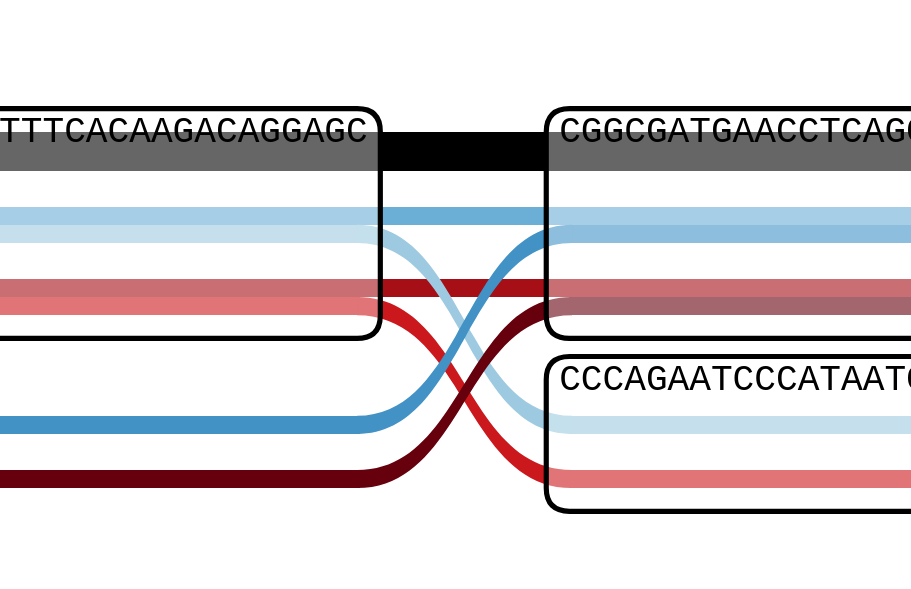
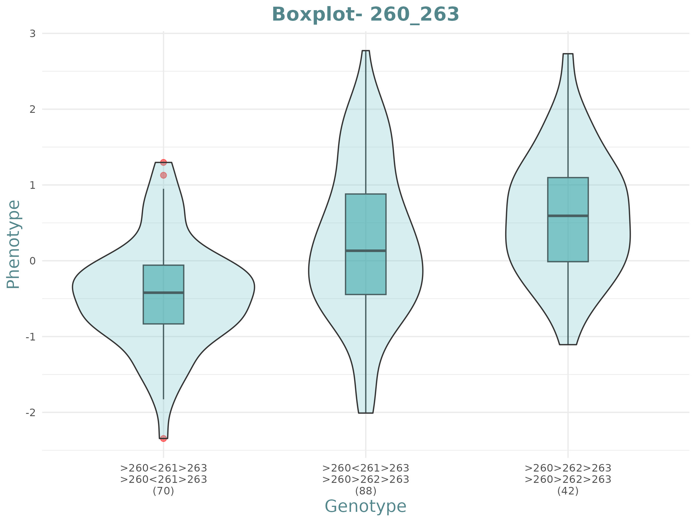
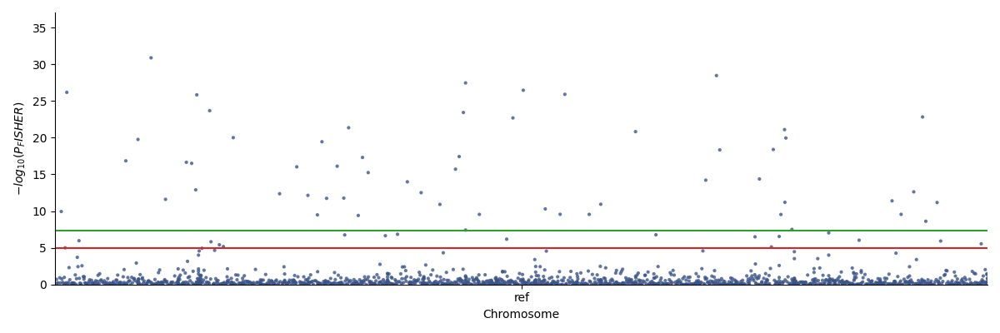
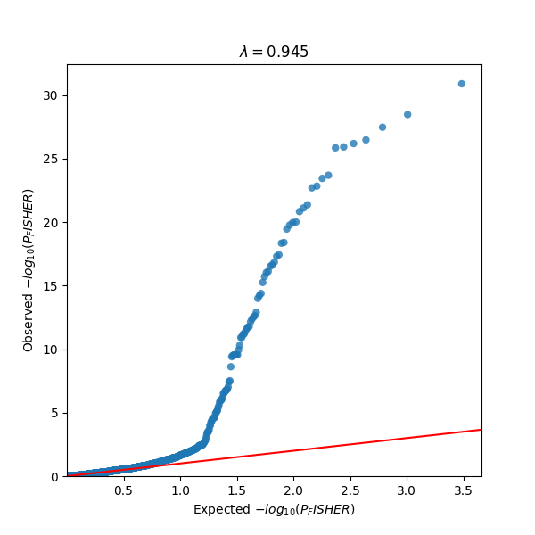

# STOAT (Snarl Tree Orchestrated Association Test)

<p align="center">
    <a href="https://isocpp.org/"></a>
    <a href="https://github.com/vgteam/libbdsg/releases/tag/v0.3"></a>
</p>


## Project Overview


## Dependency

Manual installation : 

STOAT's dependencies (`jansson`, `Protobuf`, `Boost`, `htslib`, `valgrind`) can be installed by running

```
sudo apt-get install build-essential cmake pkg-config libjansson-dev protobuf-compiler libprotoc-dev libprotobuf-dev libboost-all-dev libhts-dev valgrind
```

- [vg](https://github.com/vgteam/vg) (optional)

Note that STOAT uses [`libbdsg`](https://github.com/vgteam/libbdsg) and [`libvgio`](https://github.com/vgteam/libvgio), both of which depend on [`libhandlegraph`](https://github.com/vgteam/libhandlegraph).
STOAT uses its own copies of each of these libraries but if any of them are already installed on your system, then problems may arise if the versions are incompatible.
In general, the latest versions of all of these tools should work.

## Docker

- `Dockerfile` : [Dockerfile](https://github.com/Plogeur/STOAT/blob/main/Dockerfile)

- `Container` : docker://quay.io/matis_alias-bagarre/stoat

## Build

```bash
git clone --recursive --branch stoat_cxx https://github.com/Plogeur/STOAT.git
cd STOAT

mkdir build && cd build
cmake .. && make -j 4
```

This will create a binary file `stoat` in `STOAT/bin`. 
It can be run from the main `STOAT` directory with:

```
./bin/stoat
```

The `bin` directory can be added to your `PATH` variable to allow `stoat` to be run from any directory.
From the `STOAT` directory, run:

```
echo 'export PATH="${PATH}:'"$(pwd)"'/bin"' >>~/.bashrc
```

Then close your terminal and open it again, or run

```
source ~/.bashrc
```

STOAT is a specialized tool developed for conducting Genome-Wide Association Studies (GWAS) with a unique focus on snarl structures within pangenome graphs. Unlike traditional GWAS tools that analyze linear genome variants, STOAT processes VCF files to extract and analyze snarl regions—complex structural variations that capture nested and overlapping variant patterns within a pangenome. This approach allows for a more nuanced understanding of genetic variations in diverse populations and complex traits.

STOAT supports both binary and quantitative phenotypes:

- For binary phenotypes (e.g., case vs control studies), it utilizes chi-squared tests and Fisher’s exact test to evaluate associations between phenotype groups and snarl variants, providing robust statistical validation even in cases of sparse data.

- For quantitative phenotypes (e.g., traits measured on a continuous scale), the tool employs linear regression models to assess the association between snarl structures and phenotype values, allowing for continuous trait mapping with greater precision.

## Input format file

Required files :
- pg : Pangenome graph file, formats accepted: .pg or .xg.
- dist : Distance file generated with `vg index -j`, format: .dist.
- VCF pangenomique* : Merged VCF file, created using `vg pipeline` and bcftools merge, formats: .vcf or .vcf.gz. (ex : `bcftools merge -m none -Oz -o test`)
- phenotype : phenotype file organise in three-column with FID (family/sample name), IID (sample name), and PHENO (integer/float). Binary phenotype [1 or 2]. Quantitative [-double max; +double max] Format: .txt or .tsv (tab-separated).
- chromosome : Txt file that containt the reference chromosome haplotype name in the pangenome graph. Format: .txt or .tsv. (use : `vg paths -x <pg.full.pg> -R` to identify all haplotype name then select haplotype that you want to use as reference (idealy the ones use in the pangenome graph creation))

*The VCF pangenomique is a VCF merged from a pangenomique mapping+calling, we recommand to use the [vg snakemake pipeline](https://github.com/vgteam/vg_snakemake)

Optional file : 
- paths : Snarl decoposition stoat output, Two-column file containing snarl names and the list of paths through the snarl's netgraph, separated by tabs. Format: .txt or .tsv.
- kinship : Kinship matrix file use in LMM analysis
- covariate : Covariate file. Format: .txt or .tsv.
- position gene : File containing the gene name, start and end gene position. Format: .txt or .tsv.

VCF file :
```
#CHROM	POS	ID	REF	ALT	QUAL	FILTER	INFO	FORMAT	samp_g0_0	samp_g0_10	samp_g0_11
Chr1	411	>1>9	CGATTATGGA	C,CGATTA,CGATT,CGA	396.121	PASS	LV=0;DP=1241;AT=>1>2>4>5>6>8>9,>1>9,>1>2>3>5>6>8>9,>1>2>3>5>7>8>9,>1>2>4>5>7>8>9	GT	./1	0/2	1/3
```

Phenotype file (exemple binary):
```
FID	IID	PHENO
samp_g0_0	samp_g0_0	1
samp_g0_1	samp_g0_1	2
```

Chromosome reference file :
```
Chr1
Chr2
Chr3
```

Covariate file : 
```
IID	SEX	CP1	CP2	CP42
samp_g0_0	1	1.2	562.25	42.25
samp_g0_1	0	5.2	359.25	65.24
```

EQTL file : 
```
gene_name	samp_0	samp_1	samp_2
gene_0	12.708787454384092	7.945852683899044	9.883989099424033
gene_1	11.130996245885658	6.959378045490106	8.656895550024407
gene_2	6.369384603977239	3.982299014123415	4.953653385243532
```

Gene position file :
```
gene_name	chr	start	end
gene_0	ref	0	10000
gene_1	ref	100	10100
gene_2	ref	200	10200
```

## Usage

- Use `stoat vcf` if you want to make a GWAS from a VCF file : 

```bash
# decompose pangenome
stoat vcf -p <pg.full.pg> -d <dist.dist> -o <paths.txt>

# binary trait with already decompose pangenome
stoat vcf -s <paths.txt> -v <vcf_file.vcf.gz> -b <phenotype.txt> --chr <ref.tsv> -o output

# decompose pangenome + binary trait
stoat vcf -p <pg.full.pg> -d <dist.dist> -v <vcf_file.vcf.gz> -b <phenotype.txt> --chr <ref.tsv> -o output

# decompose pangenome + quantative trait
stoat vcf -p <pg.full.pg> -d <dist.dist> -v <vcf_file.vcf.gz> -q <phenotype.txt> --chr <ref.tsv> -o output
```

Explanation of all options:
```text
-p, --pg FILE                Path to the packed graph file (.pg)
-d, --dist FILE              Path to the packed distance index file (.dist)
-v, --vcf FILE               Path to the VCF file (.vcf or .vcf.gz)
-s, --snarl FILE             Path to the snarl file (.txt or .tsv)
-r, --chr FILE               Path to the chromosome reference file (.txt)
-b, --binary FILE            Path to the binary phenotype group file (.txt or .tsv)
-q, --quantitative FILE      Path to the quantitative phenotype file (.txt or .tsv)
-e, --eqtl FILE              Path to the Expression Quantitative Trait Loci file (.txt or .tsv)
--make-bed                   Create plink format files (.bed, .bim, .fam)
--covariate FILE             Path to the covariate file (.txt or .tsv)
--covar-name NAME            Covariate column name(s) used for GWAS (comma-separated if multiple)
-k, --kinship FILE           Path to the kinship matrix file (.txt or .tsv)
-g, --gaf                    Generate a GAF file from GWAS results
--children INT               Max number of children per snarl in decomposition (default: 50)
--cycle INT                  Max number of authorized cycles in snarl decomposition (default: 1)
--path-length INT            Max number of nodes in paths during snarl decomposition (default: 10,000)
-G, --gene-position FILE     Path to the gene position file (.txt or .tsv)
-w, --windows-gene INT       Window length from gene boundaries for snarl inclusion in eQTL (default: 1,000,000)
-T, --table-threshold FLOAT  P-value threshold for regression table output (default: disabled)
--maf FLOAT                  Minimum allele frequency threshold (default: 0.01)
-t, --thread INT             Number of threads to use (default: 1)
-V, --verbose INT            Verbosity level (0=error, 1=warn, 2=info, 3=debug, 4=trace)\n"
-o, --output DIR             Output directory name (VCF GWAS mode)
-h, --help                   Print this help message
```

- Use `stoat graph` if you want to make a GWAS from a pangenome graph:

```bash
# Binary GWAS on pangenome
stoat graph -g <pg.full.pg> -d <dist.full.dist> -T <model> -r <ref_path> -S <sample_file> -o <output_dir>
```

Explanation of all options:
```text
-g, --graph FILE                   use this graph (only hash graph works for now) (required)
-d, --distance-index FILE          Use this distance index (required)
-s, --sample-of-interest NAME      The name of the sample with the trait of interest (may repeat)
-S, --samples-file NAME            A file with the names of the sample with the trait of interest, one per line (instead of -s)
-o, --output DIR                   Output directory name [output]
-O, --output-format NAME           The format of the output (tsv / fasta) [tsv]
                                   Output will be written to DIR/binary_table_graph.tsv or DIR/associated.fasta and DIR/unassociated.fasta
-t, --threads N                    Number of threads to use
-T, --test NAME                    Which test will be used to determine association (exact / chi2) [exact]
-m, --method NAME                  What method is used to find associations? (paths) [paths]
-l, --allele-size-limit INT        Don't report variants smaller than this [0]
-r, --reference-sample NAME        If there is no reference in the graph, use this sample as the reference
-h, --help
```

## Output

| Column Name              | Description                                                                                   |
|--------------------------|-----------------------------------------------------------------------------------------------|
| **CHR**                  | Chromosome name where the variation occurs.                                                   |
| **START_POS**            | Start position of the snarl/variant within the chromosome.                                            |
| **END_POS**              | End position of the snarl/variant within the chromosome.                                              |
| **SNARL**                | Identifier for the variant, snarl name/id                                                     |
| **ALLELE_LENGTHS**       | Comma separated list of the lengths of each allele. For complex variants (which contain nested variants), there are multiple possible lengths so they are represented as a range (min/max). A SNP will appear as 1,1[,1...]. An INDEL will have one zero-length allele and the other non-zero. For `pangwas graph`, this is an estimate of the length of the snarl  |
| **REF**                  | Show if at least one paths in this snarl is on the reference (0 : off reference, 1 : on reference) |
| **P**                    | P-value calculated using linear regression (quantitative analysis).                           |
| **P_FISHER**             | P-value calculated using Fisher's exact test (binary analysis).                               |
| **P_CHI2**               | P-value calculated using the Chi-squared test (binary analysis).                              |
| **P_ADJUSTED**           | P-value adjusted by BH correction. This is equivalent to the false discovery rate. For binary analysis, only the Chi-squared value is used. |
| **RSQUARED**             | R-squared value, proportion of variance explained by the model (quantitative analysis).       |
| **SE**                   | Mean Standard error, estimation coefficients of all paths in a snarl (quantitative analysis). |
| **BETA**                 | Mean Beta coefficients, estimation effect sizes of the prediction of all paths in a snarl (quantitative analysis). |
| **ALLELE_PATHS**         | For each allele, how many samples take this allele. Comma separated list. (quantitative analysis). |
| **GROUP_PATHS**          | Encodes the allele distribution across binary phenotype groups for each path in a snarl. Each entry is formatted as `X:Y,X':Y',...` where `X:Y` represents one path, with `X` being the count of samples in group 0 and `Y` in group 1. Commas separate multiple paths within the same snarl. Used in binary statistical analysis to assess associations between path presence and phenotype. (binary analysis). |
| **DEPTH**                | How deeply nested is the variant? 1 for top-level variant, 2 for nested within a top-level variant, etc. |

### Example of Output:

Below is an example of the output for a binary phenotype analysis (-b option) :

```bash
CHR POS SNARL           ALLELE_LENGTHS    P_FISHER  P_CHI2  HAPLOTYPE_COUNT  MIN_HAPLOTYPE_COUNT ALLELE_COUNT   INTER_GROUP AVERAGE GROUP_PATHS
1   12  5262721_5262719 A,C     0.4635    0.5182  286              2             137            46          143.0   107:97,93:103
1   15  5262719_5262717 T,3     0.8062    0.8747  286              2             141            34          143.0   53:20,93:75
1   18  5262717_5262714 2,T     0.2120    0.2363  286              2             134            32          143.0   25:97,78:2
```

Below is an example of the output for a quantitative phenotype analysis (-q option) :

```bash
CHR	POS	SNARL	        ALLELE_LENGTHS	      RSQUARED	  BETA	      SE	        P
1	12	5262721_5262719	A,C	        0.8370	    0.1388	    0.6512	    0.4038
1	15	5262719_5262717	CPX:1/457,3	0.4424	    0.1324	    0.6534	    0.4657
1	18	5262717_5262714	2,G	        0.6324	    0.1646	    0.6424	    0.4748
1	19	5262717_5262714	G,15	      0.4234	    0.2324	    0.5215	    0.1324
```

Below is an example of the output for a eqtl phenotype analysis (-e option) :

```bash
CHR	POS	SNARL	ALLELE_LENGTHS	GENE	P	P_ADJUSTED	RSQUARE	BETA	SE	ALLELE_NUM	ALLELE_PATHS
1	100000	rs1_1	A,T	gene_80	0.1592	1.0000	0.0100	4.6556	0.3697	400	192,208
1	100000	rs1_1	A,T	gene_50	0.1147	1.0000	0.0125	4.3201	0.3456	400	192,208
1	100000	rs1_1	A,T	gene_90	0.3419	1.0000	0.0046	5.1966	0.3671	400	192,208
```

## Visualization

### Binary table/sequenceTubeMap & Quantitative boxplot

It can be informative to analyze how sample phenotypes are influenced by specific paths. To achieve this, we use two methods depending on the type of phenotype:

- **Binary Phenotypes**:  
  The `GROUP_PATHS` column provides a binary matrix used for statistical analysis, where `107:97,93:103` can be visualize like :
  | Group | Path 1 | Path 2 |
  |-------|--------|----------|
  | **Group0**| 107 | 93 |
  | **Group1**| 97  | 103|

  If you want a more visual representation, you can use the `--gaf` option. This will generate a GAF file in the output directory, which can be used with the [sequenceTubeMap](https://github.com/vgteam/sequenceTubeMap) tool to visualize your gwas binary region results.

<p align="center">

</p>

Description : Color represente the different paths group (red : group 1 & blue : group 0) and opacity represente the number of samples in that paths (number of samples passing trought each paths % 60).

- **Quantitative Phenotypes**:  
  There is no native column for this type of visualization. To generate the required data, use the `--table-threshold` argument. This will create, for each significant snarl, a table file with allele counts for each path, stored in a `regression` directory. You can then use the `box_plot.R` script to generate a boxplot for each snarl, comparing path usage to phenotype values.  

  **Command:**
  ```bash
  Rscript plot_script/box_plot.R -d <regression_directory> -p <phenotype_file> -o <output_directory>
  ```
  - `-d`: Directory where the regression snarl files were created  
  - `-p`: Phenotype file  
  - `-o`: Output directory for the resulting JPEG boxplot images


<p align="center">

</p>

### Manhattan and QQ Plots

To visually assess the significance and distribution of GWAS results, Stoat provides support for generating **Manhattan** and **QQ plots**. These plots help in identifying associations between genetic variations (e.g., paths in snarls) and phenotypic traits.

The plotting script supports both **binary** and **quantitative** phenotypes and requires three key inputs:

- `--pvalue`: Path to the file containing p-values per snarl/path.
- `--qq`: Output path for the QQ plot image (e.g., `qq_plot.jpg`).
- `--manh`: Output path for the Manhattan plot image (e.g., `manhattan_plot.jpg`).
- One of either:
  - `--binary`: for binary traits (e.g., disease presence/absence).
  - `--quantitative`: for continuous traits (e.g., expression levels).

**Command:**

```bash
python3 plot_gwas_results.py \
  --pvalue results/pvalues.tsv \
  --qq plots/qq_plot.jpg \
  --manh plots/manhattan_plot.jpg \
  --binary
```

Or for quantitative traits:

```bash
python3 plot_gwas_results.py \
  --pvalue results/pvalues.tsv \
  --qq plots/qq_plot.jpg \
  --manh plots/manhattan_plot.jpg \
  --quantitative
```

<p align="center">
  
  
</p>

