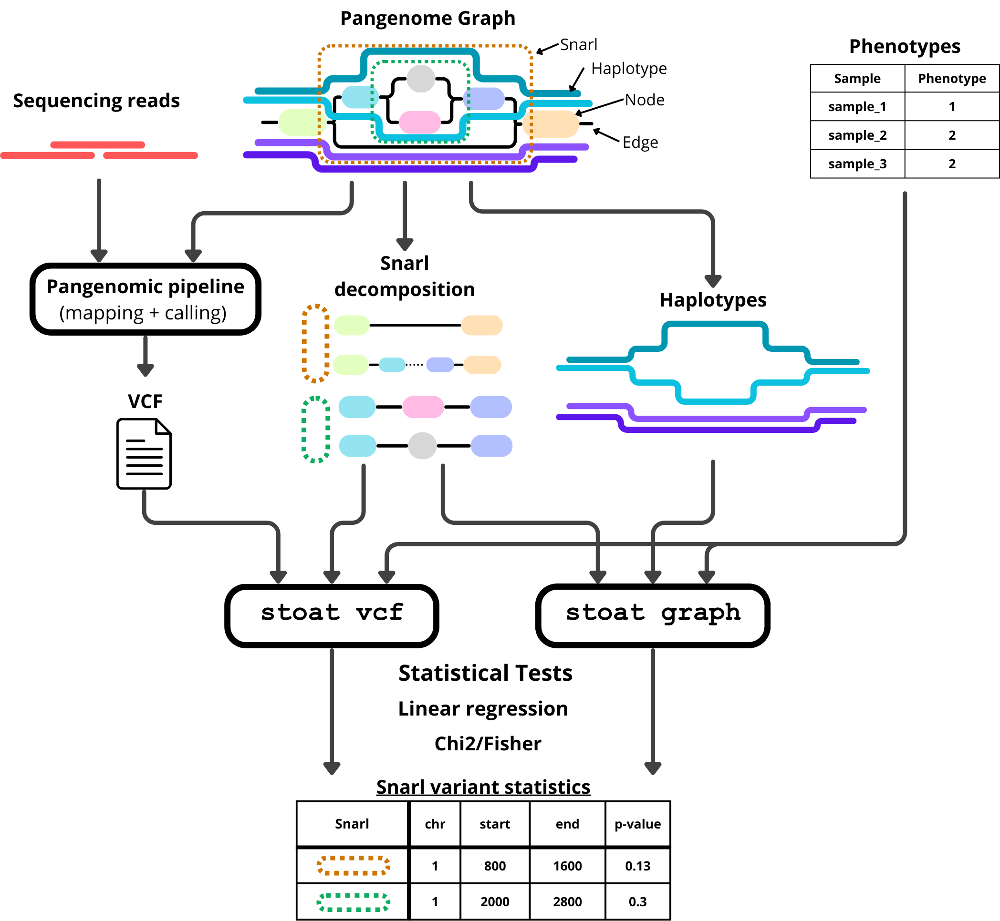

# STOAT (Snarl Tree Orchestrated Association Test)

<p align="center">
    <a href="https://isocpp.org/"></a>
    <a href="https://github.com/vgteam/libbdsg/releases/tag/v0.3"></a>
    <a href="https://quay.io/repository/patou/stoat"></a>
</p>


## Project Overview



The two take-home messages are that:

1. Snarls (bubbles) are tested independently without taking into account the nested snarls. Each snarl is tested in its "simplified" form. 
2. All snarls are tested, even if they are not on the reference path and deeply embedded in the graph.

## Dependency

Manual installation : 

STOAT's dependencies (`jansson`, `Protobuf`, `Boost`, `htslib`, `valgrind`) can be installed by running

```
sudo apt-get install build-essential cmake pkg-config libjansson-dev protobuf-compiler libprotoc-dev libprotobuf-dev libboost-all-dev libhts-dev valgrind
```

- [vg](https://github.com/vgteam/vg) (optional)

Note that STOAT uses [`libbdsg`](https://github.com/vgteam/libbdsg) and [`libvgio`](https://github.com/vgteam/libvgio), both of which depend on [`libhandlegraph`](https://github.com/vgteam/libhandlegraph).
STOAT uses its own copies of each of these libraries but if any of them are already installed on your system, then problems may arise if the versions are incompatible.
In general, the latest versions of all of these tools should work.

## Docker

- [`Dockerfile`](https://github.com/Pa-Tou/stoat/blob/main/Dockerfile)
- Docker container on [Quay.io](https://quay.io/repository/patou/stoat?tab=tags): `quay.io/patou/stoat`

## Build

```bash
git clone --recursive https://github.com/Pa-Tou/stoat.git
cd stoat

mkdir build && cd build
cmake .. && make -j 4
```

This will create a binary file `stoat` in `stoat/bin`. 
It can be run from the main `stoat` directory with:

```bash
./bin/stoat
```

The `bin` directory can be added to your `PATH` variable to allow `stoat` to be run from any directory.
From the `stoat` directory, run:

```bash
echo 'export PATH="${PATH}:'"$(pwd)"'/bin"' >>~/.bashrc
```

Then close your terminal and open it again, or run

```bash
source ~/.bashrc
```

## Running STOAT

STOAT is designed to test association across a pangenome graph. 
It tests each *snarl* (bubble variant site) to conduct a Genome-Wide Association Studies (GWAS). 
Hence, STOAT uses the [snarl decomposition](https://github.com/vgteam/vg/wiki/Snarls-and-chains) of a graph, which represents nested and overlapping variant patterns within a pangenome. 

STOAT can test the association between snarls genotypes across samples and 

- binary phenotypes (e.g. cases vs controls)
    -  without covariates using Fisher's exact test of chi-squared test
    -  with (or without) covariates using a logistic regression model. Penalized Firth regression is used when the first model fails to converge.
- quantitative phenotypes using a linear regression model.
    - Single quantitative phenotype (GWAS study)
    - Gene expression (expression QTL study)

### Usage

STOAT has two steps:

1. Retrieve the genotypes of each snarl using `stoat graph` or `stoat vcf`
2. Test for the association using `stoat test`

#### Retrieving snarl genotypes

STOAT can either retrieve the snarl genotypes from [paths in the graph](https://github.com/Pa-Tou/stoat/wiki/stoat-graph) or from a [VCF file](https://github.com/Pa-Tou/stoat/wiki/stoat-vcf) from genotyping other samples with sequencing data.

##### `stoat graph` to test haplotypes embedded as paths in the pangenome

Use `stoat graph` with the pangenome index files. 
More information in the [`stoat graph` wiki page](https://github.com/Pa-Tou/stoat/wiki/stoat-graph).

A typical command looks like:

```bash
stoat graph -g <graph.pg> -d <graph.dist> -o <output_directory>
```

##### `stoat vcf` to test samples genotyped from sequencing data

Use `stoat vcf` on the merged VCF. 
More information in the [`stoat vcf` wiki page](https://github.com/Pa-Tou/stoat/wiki/stoat-vcf).
Note: Sorting the VCF using `bcftools sort` before running `stoat vcf` can improve runtime and reduce memory usage.

A typical command looks like:

```bash
stoat vcf -g <graph.pg> -d <graph.dist> -v <genotypes.vcf.gz> --chr <ref_paths.txt> -o <output_directory>
```

#### Test for association

A typical command looks like:

```bash
stoat test -s <output_directory/snarl_genotypes.tsv.gz> -p <phenotype.tsv> -m chi2 -o <output_directory>
```

### Wiki

For more information about STOAT, see our [wiki documentation](https://github.com/Pa-Tou/stoat/wiki).
